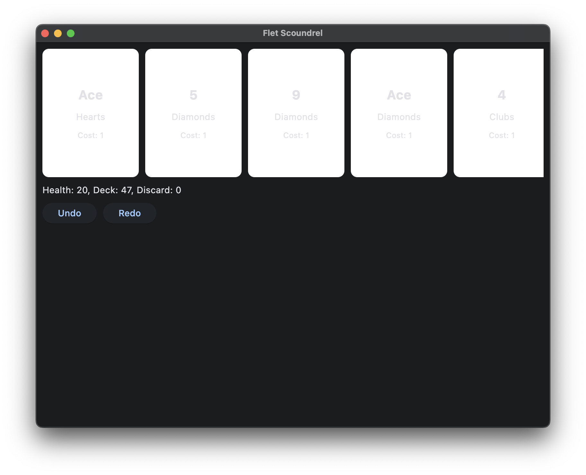
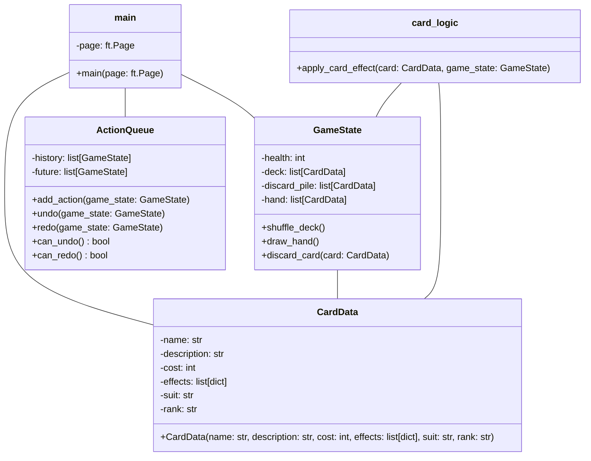

# Scoundrel: A Dungeon Crawling Card Game

A simple RPG card game built with Flet that uses a standard deck of 52 playing cards.

## Getting Started

### Prerequisites

*   Python 3.6 or higher
*   Flet (`pip install flet`)

### Installation

1.  Clone the repository:

    ```bash
    git clone https://github.com/zbuhrer/flet-scoundrel.git
    cd flet-scoundrel
    ```

2.  Install the dependencies:

    ```bash
    pip install -r requirements.txt
    ```

### Running the Game

```bash
flet main.py
```

## Usage

The game starts with the player being dealt a hand of cards. Each card has a suit, rank, cost, and effects.

*   **Click on a card** to play it.
*   **Diamonds** deal damage to the enemy.
*   **Hearts** heal the player.
*   **Spades and Clubs** summon enemies.
*   **Aces** prompt the player to choose a value of 1 or 14.
*   Use the **Undo** and **Redo** buttons to revert or replay actions.



## File Structure



## Contributing

Contributions are welcome! Please feel free to fork and submit pull requests.

## Licensing

This project is licensed under the Apache 2.0 License - see the [LICENSE](LICENSE) file for details.
